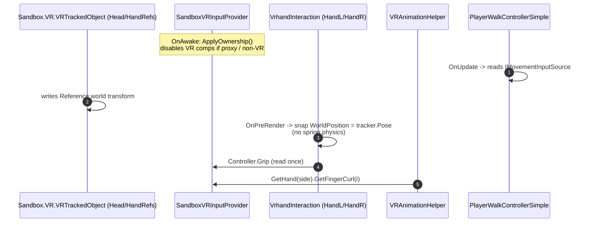

# VR Full-Body Interface-based DI Architecture

This project drives all VR/movement input through a small set of interfaces so
that consumers (hand-tracking, animation, weapons, locomotion) never touch
`Sandbox.Input.VR` directly. The result is:

- One place to disable VR for proxy players or non-VR runtimes.
- One place to swap the controller backend (e.g. record/playback for tests).
- Zero per-frame allocations on the VR-input path.
- A clean keyboard fallback so the project is playable without a headset.

## Layers

```
                 +-------------------------------+
   Abstractions  |  Code/Player/Abstractions/    |   pure interfaces & enums
                 +---------------+---------------+
                                 |
                                 v
                 +-------------------------------+
     Services    |  Code/Player/Services/        |   Component impls
                 +---------------+---------------+
                                 |
                                 v
                 +-------------------------------+
    Consumers    |  Existing Components          |   resolve via OnAwake
                 |  (VrhandInteraction, ...)     |
                 +-------------------------------+
```

## Abstractions

| Interface | File | Purpose |
| --- | --- | --- |
| `IVRInputProvider` | [`Code/Player/Abstractions/IVRInputProvider.cs`](../Code/Player/Abstractions/IVRInputProvider.cs) | Per-player VR root. Exposes `IsAvailable` + `LeftHand`/`RightHand`. |
| `IControllerInput` | [`Code/Player/Abstractions/IControllerInput.cs`](../Code/Player/Abstractions/IControllerInput.cs) | Single-controller snapshot (buttons, sticks, fingers, haptics). |
| `IHandTracker` | [`Code/Player/Abstractions/IHandTracker.cs`](../Code/Player/Abstractions/IHandTracker.cs) | World pose of a tracked hand reference GameObject. |
| `IMovementInputSource` | [`Code/Player/Abstractions/IMovementInputSource.cs`](../Code/Player/Abstractions/IMovementInputSource.cs) | Locomotion intent: `WishMove` / `WantsJump` / `WantsCrouch` / `WantsSlowWalk`. |
| `HandSide` enum | [`Code/Player/Abstractions/HandSide.cs`](../Code/Player/Abstractions/HandSide.cs) | New canonical Left/Right enum. |

## Service implementations

All under `TFT.VR.Services` in [`Code/Player/Services/`](../Code/Player/Services/):

| Type | Implements | Notes |
| --- | --- | --- |
| `SandboxVRInputProvider` | `IVRInputProvider` | One per player root. Owns the `VRAnchor` reference and the 3 `VRTrackedObject` components, disabling them on proxies / outside VR. |
| `VRControllerAdapter` | `IControllerInput` (internal) | Pass-through wrapper over `Sandbox.VR.VRController`. |
| `NullController` | `IControllerInput` (internal) | Returned by the provider whenever `IsAvailable` is `false`. Eliminates null checks. |
| `SandboxVRHandTracker` | `IHandTracker` | Sits on `HandLRef` / `HandRRef`. Reports pose from the GameObject driven by `Sandbox.VR.VRTrackedObject`. |
| `VRMovementInputSource` | `IMovementInputSource` | Translates `IControllerInput` (left stick / right A / right B / left stick press) into movement intent. |
| `KeyboardMovementInputSource` | `IMovementInputSource` | Reads `Input.AnalogMove`, `Input.Pressed("Jump")`, etc. for non-VR play. |
| `CompositeMovementInputSource` | `IMovementInputSource` | Picks VR vs. keyboard at runtime via `Game.IsRunningInVR`. |

## Resolution rule

Every consumer follows the same idiom in `OnAwake` (or `OnStart` if it depends
on a fully-initialized child hierarchy):

```csharp
private IVRInputProvider _input;

protected override void OnAwake()
{
    _input = Components.Get<IVRInputProvider>( FindMode.EverythingInSelfAndAncestors );
}
```

For weapons / held items the provider isn't on the item's hierarchy, so they
go through the held hand instead - `VrhandInteraction.Controller` is exposed
publicly:

```csharp
var controller = GrabPoint.GrabbedHand?.Controller;
if ( controller is null || !controller.IsTracked ) return;
```

## Per-frame behavior



Key design decisions:

1. **`VrhandInteraction` runs in `OnPreRender`** so it reads the current frame's
   tracker pose, not the previous one. This is what fixed Quest 3 hand
   tracking.
2. **Hand body is kinematic** (`Body.MotionEnabled = false`). The previous
   spring-joint chain (`PhysicsSpring(150, 5)`) was the lag source.
3. **Provider returns `NullController`** instead of `null` when VR is
   unavailable, so consumers can keep their straight-line code.
4. **Movement is split**: keyboard source works without an HMD, and the
   composite source picks the right one each frame.

## Adding a new VR-aware component (SOP)

1. Add `using TFT.VR.Abstractions;`.
2. Declare a private field for the dependency you need:
   - All-controller access -> `IVRInputProvider`
   - Single hand on a held item -> `VrhandInteraction.Controller` via the GrabPoint
   - Hand pose -> `IHandTracker`
   - Locomotion -> `IMovementInputSource`
3. Resolve in `OnAwake` via
   `Components.Get<T>( FindMode.EverythingInSelfAndAncestors )`.
4. Guard with `if ( _input is null || !_input.IsAvailable ) return;` (or
   equivalent for movement / tracker).
5. Read state through the interface only - never call `Input.VR.X`.

## Updating Player.prefab

The DI services are baked into `Assets/prefabs/Player.prefab`:

- `player` root: `SandboxVRInputProvider`, `VRMovementInputSource`,
  `KeyboardMovementInputSource`, `CompositeMovementInputSource`.
- `HandLRef`, `HandRRef`: each carries one `SandboxVRHandTracker` referencing
  itself.

When opening the prefab in the s&box editor for the first time after this
change, expect to see those components already populated. The prefab keeps
all original GUIDs so existing scene references are unaffected.
